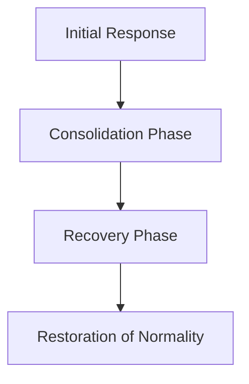

To build an effective plan several key factors need to be considered and management plays a crucial role. Senior management can outline key requirements, ensure the essential processes, and consider other stakeholders versatile views.

Defining the cause that led to an incident can help in developing an effective response plan.
Many organisations have used the triage matrix to understand the severity of the incident, as well as to plan and respond promptly.
## Stages of an Incident

**Initial response phase**
- There must be a scalable response from all the involved factors or emergency dependent.
- The teams need to declare the incident and inform the relevant stakeholders.
- Immediate action to minimise the risks adhering to the safety policies.

**Consolidation phase**
- Involve emergency services as soon as the initial response phase triggers. It will help in managing the coordination to advise and respond by looking at the present situations.
- Lastly communicating with the control room and other stakeholders will take place.

**Recovery phase**
- Process of restoring and reinstating the organisations work will be the priority
- Swift actions to deal with the impact
- A formal meeting with management, incident response team and stakeholders will occur, along with relevant actions

**Restoration phase**
- Ensure the continuity of the actions that have been taken place in the recovery phase and look for long-term
## Key steps to have a successful IR plan as per the organisations needs
- Develop and update a plan
- Maintain and acquire infrastructure and tools
- Improve skills and support training
- Possess latest threat intelligence capabilities
## Triage matrix
The primary post-detection IR procedure that any responder will implement to declare it as an incident or just an event.

Arranging a good and accurate triage process will reduce errors in the detection and follow the right procedure to implement the IR plan. This it is certain that only legitimate alerts are promoted to investigation or incident status.

Recommendations for furthering analysis before data is validated:
**Organisation**
- Reduce redundant analysis by developing a roadmap that will assign tasks to responders
- Prevent sharing an email alias between numerous responders and use a workflow tool to allocate tasks as an alternative
- Execute a process to re-assign or reject tasks that are out of scope for triage

**Correlation**
- Use a tool to combine similar events
- Connect potential events into one useful event

**Data Enrichment**
- Automate common queries that responders perform daily
- Gather data with the event or make it easily understandable
- Examples:
	- Reverse DNS lookups
	- Threat intelligence lookups
	- IP address mapping
	- Domain mapping
	- Historical events
	- Incident notes

![[Pasted image 20260924123132.png]]
## Steps to create an incident response plan
**Preparation**:  
- Use triage matrix to prepare for potential incidents
- Address potential security issues
- Include explicit instructions
- Guidelines developed here will focus on critical areas

**Identify the scope**:
- Know the size of the incident
- Understand the root cause
- Identify the first point of contact
- Gather **ACCURATE** information
- what, why, where and how

**Containment**: 
- Use isolation techniques
- Break connections
- Stop any contaminated systems from interacting with healthy ones 

**Eradication:** 
- Disable system
- Change security codes
- Temporarily shut down the system

**Restoration**: 
- Rebuild impacted devices
- Store from clean backups
- Ensure appropriate functioning

**Future improvements**: 
- Learn from how the incident is handled
- Complete a post review
- Reflect on any changes made