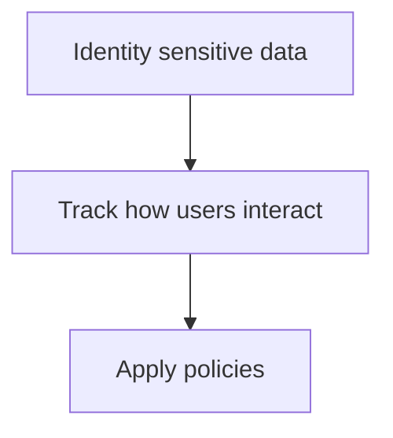
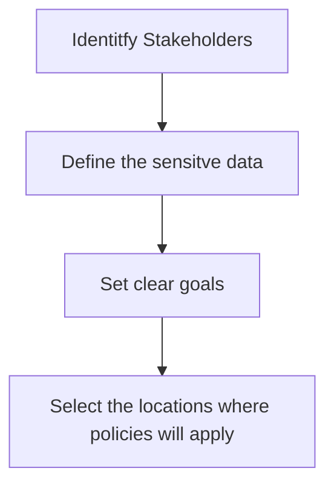

# DLP
DLP is used to prevent unintentional sharing or misuse of sensitive data across 365.
- Restrict access to sensitive information
- Applies controls across applications
- Guides users with policy tips

#### How DLP Policies work

#### Plan and Design DLP Policies

## Requirements
#### Licensing
- E3/G3 for core DLP
- E5/A5/G5 for Endpoint DLP, EDM and adaptive protection
#### Roles
- Compliance admin
- Information protection admin

Audit logging must be enabled to capture user activity and policy match events

