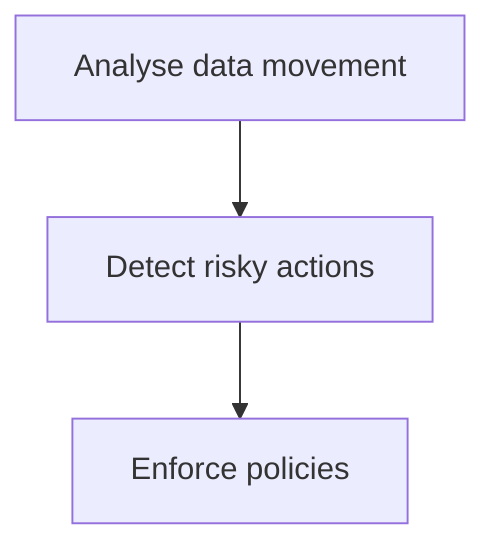

Use DLP policies to protect data on devices, prevent data exfiltration, provide consistent enforcement and increase user awareness.

**How endpoint DLP policies work:**

## Endpoint DLP implementation workflow
1. Onboard devices using Intune Configuration Manager or Defender for Endpoint
2. Configure settings such as restrict browsers
3. Define policies
4. Test the policies in simulation to refine conditions and reduce false positives
5. Deploy policies to a pilot group and gather feedback
6. Review and respond