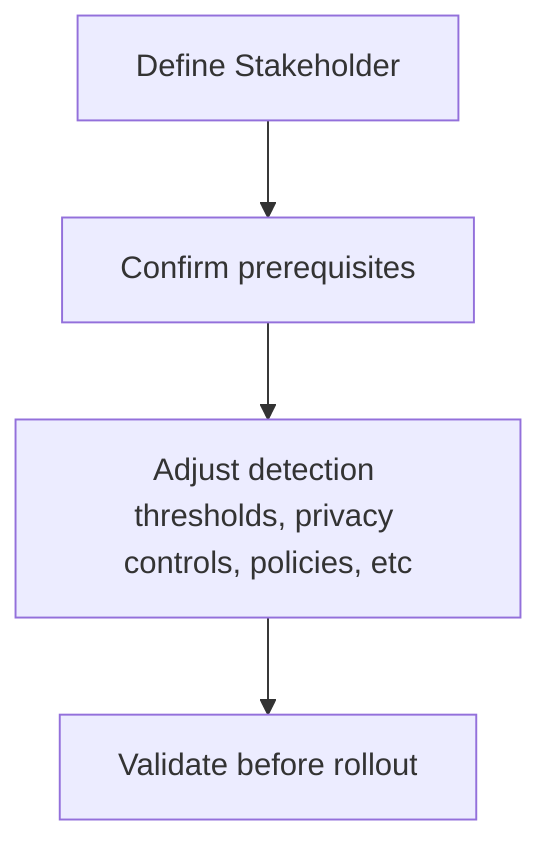

# What is Insider Risk?
Insider risk occurs when a user misuses legitimate access in ways that may cause data loss, security issues or compliance violations.
### Types
- **Malicious** - Has intent
- **Accidental** - Unintentional
# Microsoft Insider Risk Management
Help organisations identity and address internal risks by analysing user activity

Helps:
- Detect potential data leaks
- Surface activity that might indicate risky behaviour
- Review alerts and refine policies
- Notify users when policies require it
- Maintain privacy
# Planning for Insider Risk Management
Ensure risk management aligns with security, compliance and privacy needs.

# Requirements for Insider Risk Management
- Requires 365 E5 compliance or equivalent
- Audit logging must be enabled to collect user activity signals
- Connect HR, Defender for Endpoint, DLP alerts and cloud apps
- Ensure admins, investigators and analysts have the right permissions
