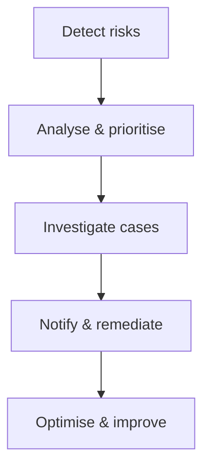

# Overview

# Reports
Use reports to analyse risk trends, identify policy violations and refine insider risk policies.
## Report Types
- Alert report
- Case report
- User activity report
- Analytics report
# Browser signal detection
Risky activity often occurs in web browsers.
Browser signal detection captures activity to help identify data leaks and policy violations.
# Manage workflow
The **User Dashboard** provides a view of user activity and risk insights to help investigators assess potential risks.