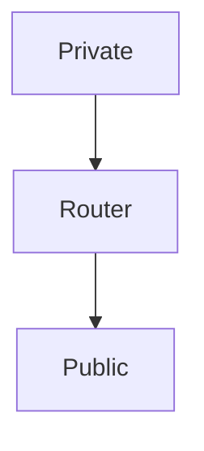

Translates Private IP to Public IP addresses

## Types
- Static NAT (1 to 1)
- PAT (NAT overload) (many to 1)
- Dynamic NAT
# Static NAT
Maps local address to global address.

- You have a local address and specify a public/global  address the a device uses.
- Specific public/global address for every local address
- **Horrible for scaling**
![[Pasted image 20260911082936.png]]
### Configuration
1. Identify the interfaces
2. Configure interface roles
3. Create static mappings
```
NAT-Router(config)# interface gig0/0
NAT-Router(config-if)# ip nat inside
NAT-Router(config-if)# exit

NAT-Router(config)# interface gig0/1
NAT-Router(config-if)# ip nat outside
NAT-Router(config-if)# exit

												local       global
NAT-Router(config)# ip nat inside source static 10.10.10.10 51.42.1.61
NAT-Router(config)# ip nat inside source static 10.10.10.20 51.42.1.62
```
# Dynamic NAT
Translates private IP addresses to public IP addresses using a pool of available public/global address. By having a pool of global addresses configured for dynamic allocation.

ACLs define the matching criteria for which inside local addresses should be translated.
**Translation only occurs when there is an available address in the pool.**

![[Pasted image 20260911083443.png]]
## Configuration
![[Pasted image 20260911083546.png]]
```
NAT-Router(config)# interface gig0/0
NAT-Router(config-if)# ip nat inside
NAT-Router(config-if)# exit

NAT-Router(config)# interface gig0/1
NAT-Router(config-if)# ip nat outside
NAT-Router(config-if)# exit

! ACL is used to specify IP addresses to use NAT
NAT-Router(config)# ip access-list standard NAT_THE_LAN
NAT-Router(config-std-nacl)# permit 10.10.10.0 0.0.0.255
NAT-Router(config-std-nacl)# exit

! Create pool of public IPs      name        1st        last
NAT-Router(config)# ip nat pool PUBLIC_IPs 51.42.1.59 51.42.1.62 netmask 255.255.255.248
                                                 ACL            IP Pool
NAT-Router(config)# ip nat inside source list NAT_THE_LAN pool PUBLIC_IPs
```
# Port Address Translation (PAT)
Works same as Static NAT, but allows multiple local addresses to share a single public IP address.
**Uses port numbers** to distinguish between communication flows.

**Uses to IP address on the outside interface**
![[Pasted image 20260911083747.png]]
## Configuration
1. Identify the interfaces
2. Configure interface roles
3. Define internal traffic
	Create ACL to specify which inside local IP address should be translated
4. Configure PAT with overload
![[Pasted image 20260911083900.png]]
```
NAT-Router(config)# interface gig0/0
NAT-Router(config-if)# ip nat inside
NAT-Router(config-if)# exit

NAT-Router(config)# interface gig0/1
NAT-Router(config-if)# ip nat outside
NAT-Router(config-if)# exit

! ACL is used to specify IP addresses to use NAT
NAT-Router(config)# ip access-list standard NAT_THE_LAN
NAT-Router(config-std-nacl)# permit 10.10.10.0 0.0.0.255
NAT-Router(config-std-nacl)# exit

NAT-Router(config)# ip nat inside source list NAT_THE_LAN interface gig0/1 overload
```
